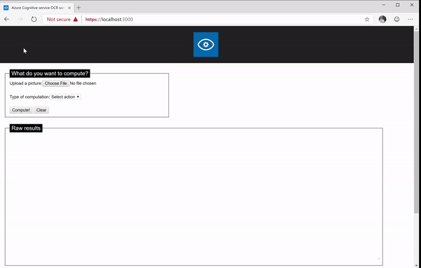

# Overview

Sample Reactjs project to use OCR, an Azure cognitive service:



# Installation

Clone the repo, then

```sh
npm install
```

Rename *.env-sample* into *.env*, and add both values after provisioning "Computer vision" service on your [portal](https://portal.azure.com).

```js
REACT_APP_BASE_OCR_URL=https://{REGION}.api.cognitive.microsoft.com/vision/v2.0/recognizeText?mode=Printed
REACT_APP_BASE_OCR_SECRET={Key}
```

Start the server

```sh
HTTPS=true npm start
```

Open a browser, and launch http://localhost:3000

# Local OCR service

Microsoft proposes some of the [cognitive services as docker images](https://docs.microsoft.com/en-us/azure/cognitive-services/cognitive-services-container-supportà) - so that, nothing is sent to Azure (except usage, but no data). This sample project also supports this mode, however, it requires a bit of configuration.

First you need to  [Request access](https://docs.microsoft.com/en-us/azure/cognitive-services/cognitive-services-container-support#container-availability-in-azure-cognitive-services) to the repo that host these images (pick the service you want to use, for this tool, it will be *Recognize text*)

One thing I have noticed is this container does not set the HTTP headers in order to consume the services from a React app (if you do not know what CORS mean, [go there](https://fr.wikipedia.org/wiki/Cross-origin_resource_sharing))

Therefore, you will find in this repo a docker-compose configuration file that will allow to start a reverse proxy using Nginx, and make sure headers are set properly.

Make sure Docker is installed, then open a terminal console and navigate to your repo.

Rename *docker-compose-sample.yml* into *docker-compose.yml* and set {REGION} and apiKey {APIKEY} according to what you got from the registration

```yml
command: Eula=accept Billing=https://{REGION}?.api.cognitive.microsoft.com/vision/v2.0 ApiKey={API-KEY}
```

In *nginx.conf*, adapt the port you want Nginx to listen on (default is 8080)

```sh
listen 8080;
```

Start the containers

```sh
/> docker-compose up -d
```

You can now proceed with this application configuration. Edit the .env file, and add the container endpoint, adapting only the port if you modified it in *nginx.conf*:

```js
REACT_APP_LOCAL_ENDPOINT=http://localhost:8080/vision/v2.0/recognizeText?mode=printed
```

As you can see, the mode used is **printed**. As of today (July 2019), this is the only supported mode.

You can now try the **OCR Local** version!

You just need to launch ocr-reactjs without HTTPS

```sh
npm start
```

Open a browser, and launch http://localhost:3000

# Small note

As of today (July 2019) both endpoints (in Azure and in the container) do not share the same input and output parameters. Therefore, this small application makes the distinction between "remote" (in Azure) and "local" (in the container).

# Misc

Sample project under MIT - do whatever you want with it :)
